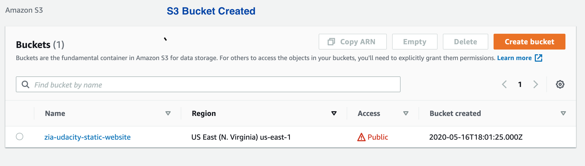
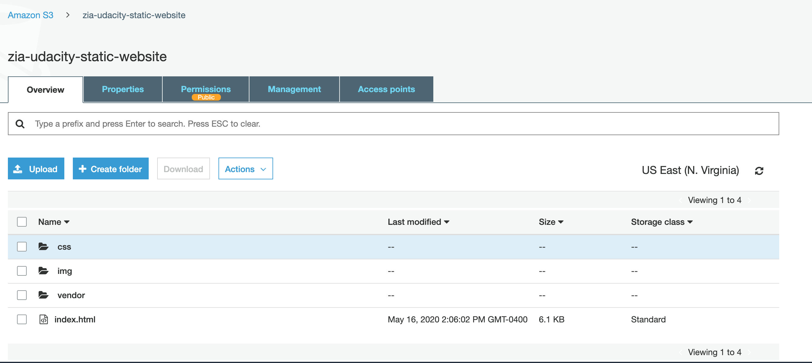

# Deploy Static Website on AWS
## Demonstrates setting up static website on AWS

This project, will deploy a static website to AWS using S3, CloudFront, and IAM.

Following are files included that are part of Static Website: 

* _**index.html**_ - The Index document for the website.
* _**/img**_ - The background image file for the website.
* _**/vendor**_ - Bootssrap CSS framework, Font, and JavaScript libraries needed for the website to function.
* _**/css**_ - CSS files for the website.

Steps:

1. Create S3 Bucket

2. Uploaded Website files

